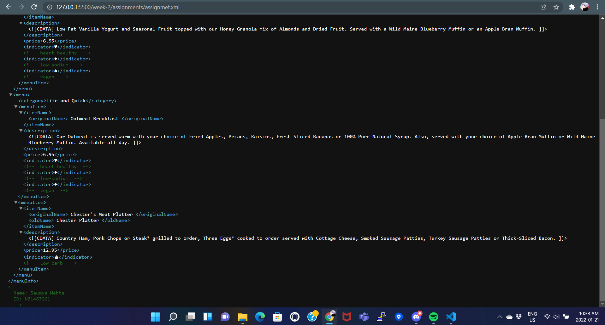
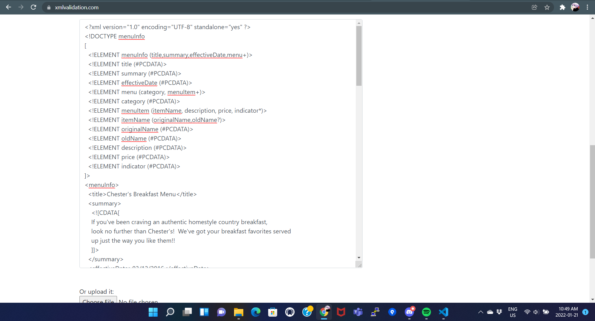
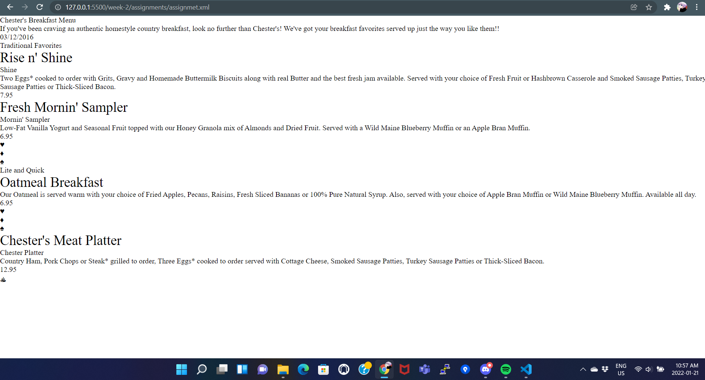

1.) Open `week-2/assignments/assignment.xml` in your browser. Are there any errors? Explain the error and fix it.\
**A.** The following error occurs:
error on line 11 at column 18: Specification mandates value for attribute Date.
This error occurs due to the tag effectiveDate having additional -space in between the words effective 
and Date which makes the browser to consider Date as an attribute of the tag effective without a value, making in result in the above error.
So to fix this error we can just remove the space between the words in the tag.

2.) What is the use of CDATA block in this document?\
**A.** CData stands for character data, it is used to process reserved characters in xml as character data instead of xml characters.
In this document we have used CDATA in item description as it might contain some special characters.

3.) Add comment line to the end of file which contains you name and student id.\
**A.** 

4.) Identify prolog, document body, and epilog in the document. Are there any processing instructions?\
**A.**
Prolog : <?xml version="1.0" encoding="UTF-8" standalone="yes" ?>\
Document body: The contents of the tag <menuInfo></menuInfo> and the tag itself make the document body.\
Epilog: The student name and id comment is considered as epilog.\
No so far in the document there are no processing instructions.

6.) Verify that file is well-formed and valid.\
**A.** 

7.) Create `style.css` file and link it to the file. Add the following styles to the .css:\

