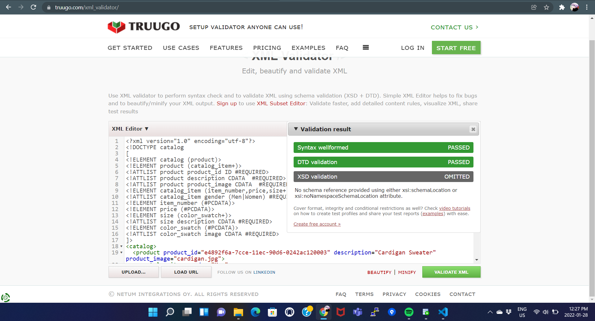
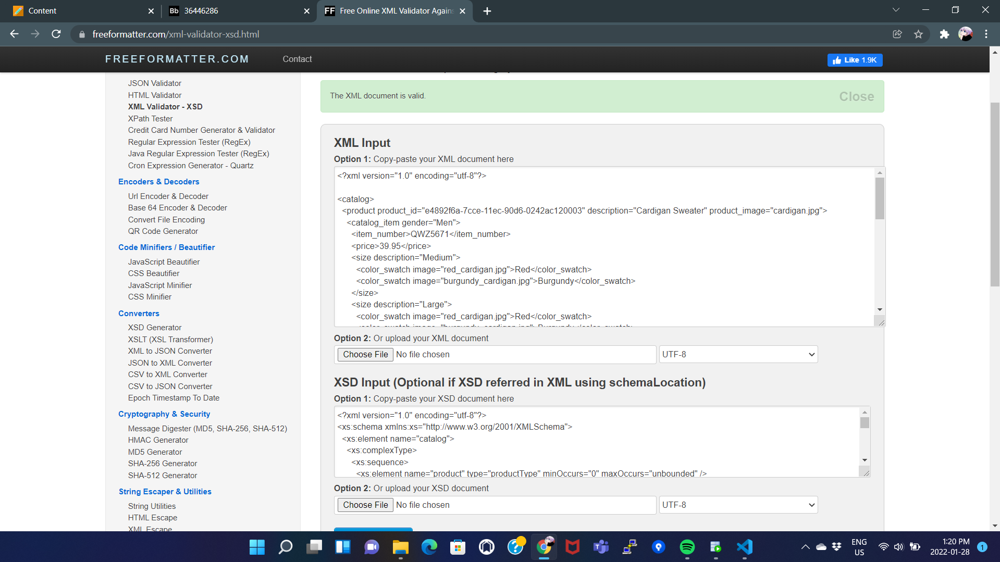

2.) Create DTD for this file and validate it using any of the tools we used\
**A.** 

3.) Create XSD for this file and validate it using any of the tools we used\
**A.** 

4.) Explain your thought process for these 2 declarations\
**A.**
DTD validations are relatively simpler in structure and readability,
but they have relatively less amount of data types present for validation

Meanwhile xsd validations have a comparatively complex structure but they
provide more data types, which provides better valiadtion control over the type of data
