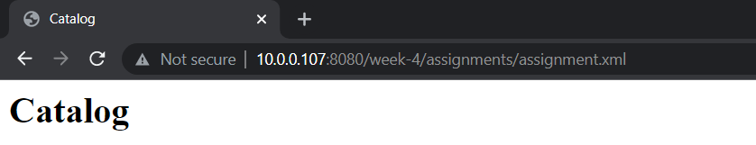
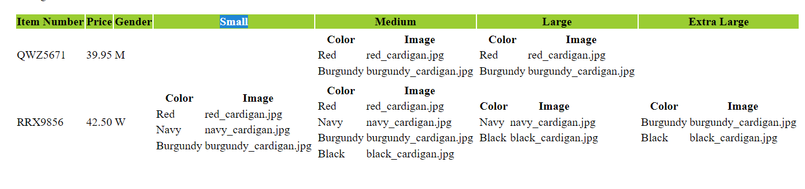
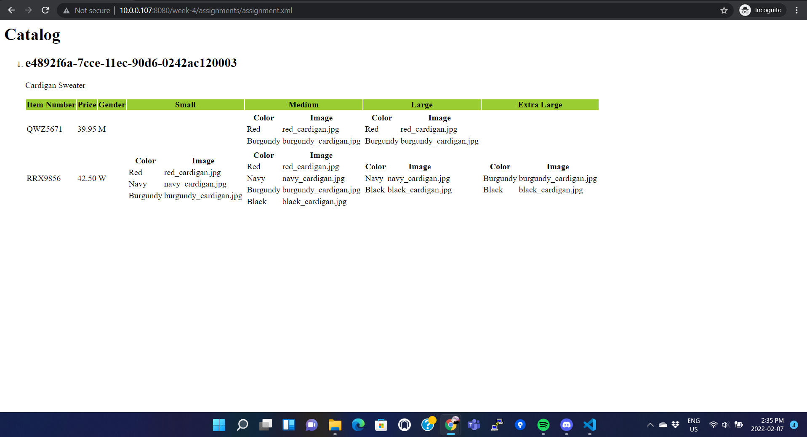

Xsl is really helpful to present xml data in a proper format and style,
For adding 

Set the page title as catalog using a static html tag.
Then inside the list tag, added the article tag and within that added the product id and description

After that added the main table for item
used xsl foreach loop to generate the rows for the table
also another foreach for the subtable for sizes inside the existing loop
and a if condition for gender and sizes to display the values as required.

Heres how the entire output looks like

